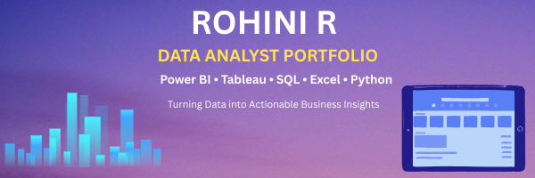

  

# Hi, I'm Rohini 👋

Aspiring Data Analyst with hands-on experience in Power BI, Tableau, SQL, Excel, and data visualization.
I enjoy transforming raw business data into meaningful dashboards that help organizations make informed decisions.
Currently building projects in Sales Analytics, HR Analytics, Customer Service Analytics, Healthcare Analytics, and Business Intelligence.

## 📂 Skills

| Category | Skills |
|----------|---------|
| BI Tools | Power BI, Tableau |
| Database | SQL |
| Analytics | Excel, EDA |
| Visualization | Dashboard Design |
| AI | Prompt Engineering |
| Languages | Python |

## 📂 Featured Projects

| Project | Tool | Domain | Skills | Repository |
|---------|------|---------|---------|------------|
| Bike Sales Dashboard | Tableau | Sales | Dashboard, KPI Analysis | [View](https://github.com/Rohini-13/Bike-Sales-Analysis--Tableau-Dashboard) | 
| Electric Vehicle Dashboard | Tableau | Automotive | Visualization | [View](https://github.com/Rohini-13/Electric-Vehicle-Dashboard---Tableau) |
| HR Dashboard | Power BI | HR | Workforce Analytics | [View](https://github.com/Rohini-13/HR-Analysis-PowerBi-project) |
| Netflix Dashboard | Power BI | Entertainment | Data Visualization | [View](https://github.com/Rohini-13/Netflix-Dashboard-PowerBi-project) |
| Call Center Dashboard | Power BI | Customer Service | KPI Analysis | [View](https://github.com/Rohini-13/Call-Center-Analysis-Dashboard-Power-BI-) |
| DiabetesPulse AI Agent | Python | Healthcare | AI Agent | [View](https://github.com/Rohini-13/DiabetesPulse-AI-Agent) |

### Analytics & BI
- Power BI
- Tableau
- KPI Analysis
- Dashboard Design
- Data Storytelling

### Data Analysis
- SQL
- Excel
- Data Cleaning
- Exploratory Data Analysis (EDA)
- Business Analysis

### AI & Emerging Technologies
- AI Agents
- Prompt Engineering
- Healthcare Analytics

---

# Featured Projects

## 🚲 Bike Sales Analysis Dashboard (Tableau)

Repository:
https://github.com/Rohini-13/Bike-Sales-Analysis--Tableau-Dashboard

### Project Overview
Interactive Tableau dashboard analyzing bike sales performance across products, customers, age groups, and regions.

### Key Insights
- Top-performing products
- Profit analysis by customer demographics
- Regional sales performance
- Year-over-Year growth analysis

### Tools
Tableau, Data Visualization, Business Analytics

---

## ⚡ Electric Vehicle Dashboard (Tableau)

Repository:
https://github.com/Rohini-13/Electric-Vehicle-Dashboard---Tableau

### Project Overview
Comprehensive EV adoption and performance dashboard.

### Key Insights
- EV market trends
- Adoption analysis
- Geographic performance metrics

### Tools
Tableau, Data Visualization

---

## 🏥 DiabetesPulse AI Agent

Repository:
https://github.com/Rohini-13/DiabetesPulse-AI-Agent

### Project Overview
AI-powered healthcare assistant focused on diabetes-related insights and support.

### Skills Demonstrated
- AI Agent Development
- Healthcare Analytics
- Prompt Engineering

### Tools
Python, AI Technologies

---

## 📈 Classic Models Sales Analysis Dashboard

Repository:
https://github.com/Rohini-13/Classic-Models---Sales-Analysis-Dashboard-

### Project Overview
Sales performance dashboard analyzing revenue, products, and business KPIs.

### Skills Demonstrated
- Sales Analytics
- KPI Tracking
- Business Intelligence

---

## 🎬 Netflix Dashboard (Power BI)

Repository:
https://github.com/Rohini-13/Netflix-Dashboard-PowerBi-project

### Project Overview
Analysis of Netflix content library and trends.

### Skills Demonstrated
- Content Analytics
- Interactive Dashboard Design
- Data Visualization

### Tools
Power BI

---

## 🚴 Bike Company Dashboard (Power BI)

Repository:
https://github.com/Rohini-13/powerbi-bike-company-dashboard-

### Project Overview
Business dashboard providing sales and operational insights for a bike company.

### Tools
Power BI, Business Intelligence

---

## 👥 HR Analysis Dashboard (Power BI)

Repository:
https://github.com/Rohini-13/HR-Analysis-PowerBi-project

### Project Overview
Workforce analytics dashboard focused on employee trends and HR KPIs.

### Key Metrics
- Employee distribution
- Attrition analysis
- Workforce insights

### Tools
Power BI

---

## 📞 Call Center Analysis Dashboard (Power BI)

Repository:
https://github.com/Rohini-13/Call-Center-Analysis-Dashboard-Power-BI-

### Project Overview
Customer service and operational performance dashboard.

### Key Metrics
- Call volume
- Agent performance
- Customer service KPIs

### Tools
Power BI

---

# Technical Skills

| Category | Skills |
|-----------|----------|
| BI Tools | Power BI, Tableau |
| Databases | SQL |
| Data Analysis | EDA, Data Cleaning, KPI Analysis |
| Visualization | Dashboard Design, Storytelling |
| AI | AI Agents, Prompt Engineering |
| Business Domains | Sales, HR, Customer Service, Healthcare |

---

# Contact

GitHub:
https://github.com/Rohini-13

---

⭐ Thank you for visiting my portfolio.# Data-Analyst-Portfolio
